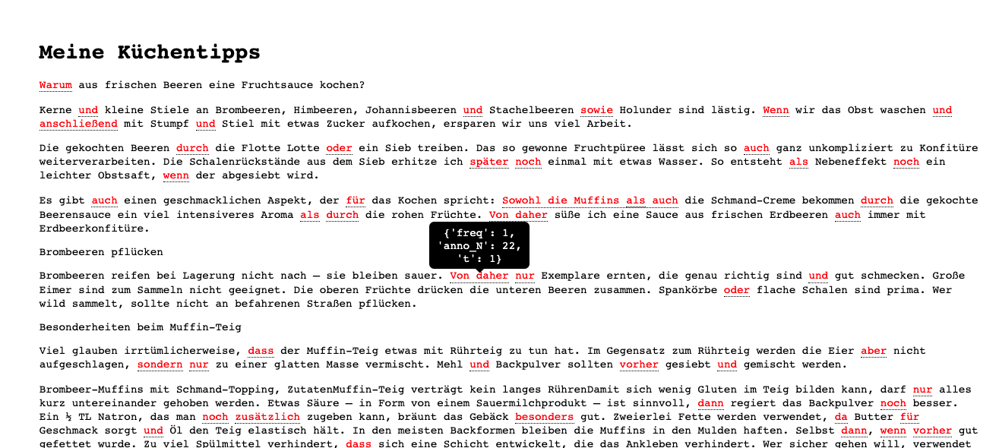

# Konnektoren erkennen

## Übersicht
Dieses Programm liest das deutsche Konnektorenlexikon DimLex als JSON ein (gefunden auf connective-lex.info) und merkt sich den Konnektor-string als Regular Expression, sowie die Information, ob das Wort auch eine Nicht-Konnektor Lesart hat. 

Dann kann ein Text als txt-Datei eingelesen werden, welcher in eine html-Datei transformiert wird, die denselben Text enthält, in dem aber alle Wörter, die mit einem Konnektor-string übereinstimmen, farblich markiert sind: 
- Grün = dieses Wort ist in jedem Fall ein Konnektor.
- Rot = dieses Wort kann ein Konnektor sein, muss aber nicht. 

### Beispielausgabe:


## Dateien
Die in diesem Projekt eingelesene DimLex file ist aus dem Connective-Lex.info Git Repository heruntergeladen worden:
https://github.com/discourse-lab/Connective-Lex.info/blob/master/Web%20app/xml/dimlex.json

Darüber hinaus enthält das einige Beispieleingabetexte in data/ und die entsprechenden html-Outputdateien im Ordner html/.

Im Ordner material/ befinden sich Dateien (Vorlesungsfolien), die zur Bearbeitung des Projekts genutzt wurden.

In Root befindet sich ein Jupyter Notebook und ein Python Script, die dasselbe Programm enthalten, aber das Python Script benutzt die argparse Library und kann daher mit Argumenten aufgerufen werden. Im Abschnitt Sample Calls können einige Beispielaufrufe gefunen werden.

## Sample Calls
```Bash
python3 ConnReco.py -i data/kuechentipps.txt -o html/kuechentipps.html
python3 ConnReco.py -d data/dimlex.json
python3 ConnReco.py
```
